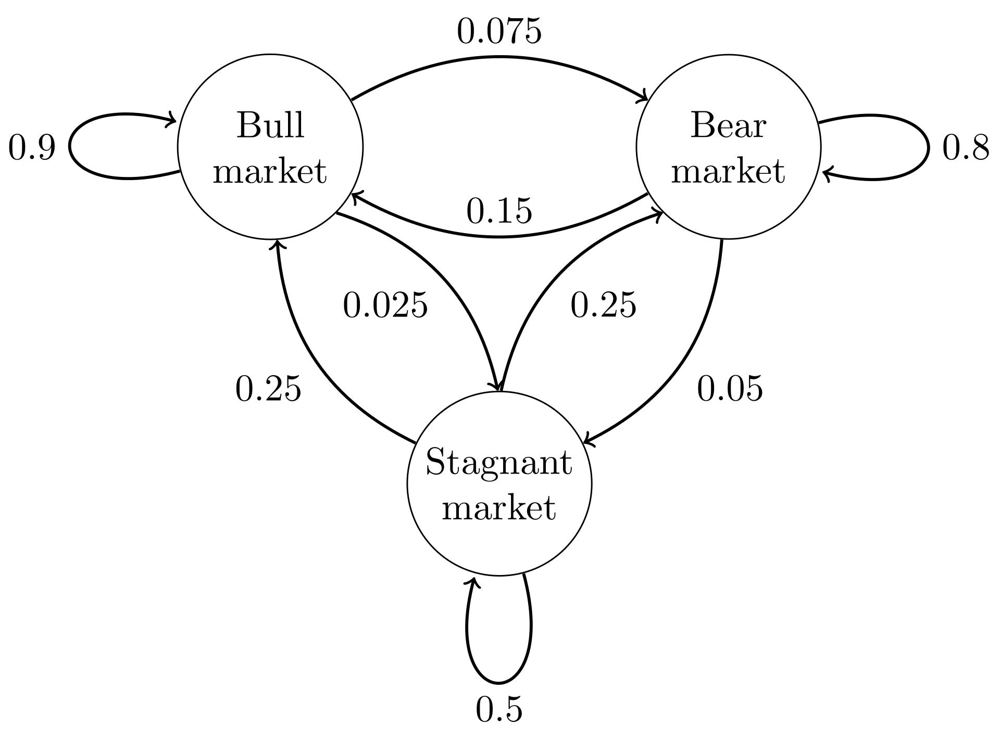

## Markov Chain

---
### [Markov Property](https://en.wikipedia.org/wiki/Markov_property)

* the momoryless property of a stochastic/ramdom process
* the `conditional probability distribution` Y|X=t0  of future states of the process `depends only upon the present state`, not on the sequence of events that preceded it. 
* P(Xn=xn|Xn-1=xn-1,...,X0=x0)=P(Xn=xn|Xn-1=xn-1)

---

### [Markov Chain](https://en.wikipedia.org/wiki/Markov_chain)

#### `definition`
* A discrete-time stochastic process satisfying the Markov property
* a type of Markov process that has either a discrete state space or a discrete index set (often representing time), regardless of other variables.

#### `classification`
<table>
<tr>
    <th></th>
    <th>Countable state space</th>
    <th>Continuous/General state space</th>
</tr>
<tr>
    <th>Discrete Time</th>
    <td>DTMC</td>
    <td>Harris Chain</td>
</tr>
<tr>
    <th>Continuous Time</th>
    <td>Markov jump process</td>
    <td>CTMC, eg: Wiener process</td>
</tr>
</table>

+ DTMC
   + state space S={P[Xi]}
   + described by a sequence of directed graphs
     + edge of n := P[Xn -> Xn+1]
     + omit edges with 0 transition probability

+ Time-homogeneous/Stationary Markov Chain
   + P[ Xn+1 = x | Xn = y ] = P[ Xn = x | Xn-1 = y ]
   + the transition probability is independent of n

+ Markov chain with memory 
   + order m := [#finite states the probability depends on]
   + Markov chain Yn=(Xn,Xn-1,...,Xn-m+1)

#### `examples`

+ Gambling
   + fair coin toss
   + start with $10
   + Xn := [#dollar you got]
   + DTMC

+ Birth-death process
   + 100 popcorn
   + each poping at an indipendent exp-distributed time
   + Xt := [#corns popped up to time t]
   + CTMC -- Poisson point process

+ Hypothetical stock market
</img>
   + transition matrix 

   

   $$
   \begin{bmatrix}
   \multirow{3}[0]{*}{P=}&
      & 0.9 & 0.075 & 0.025\\
      & 0.15 & 0.8 & 0.05\\
      & 0.25 & 0.25 & 0.5 
   \end{bmatrix}
   $$

   + distribution over states == stochastic row vector x 
     
   

   $x^{\left(n+m\right)}=x^{\left(n\right)}\dot P^{m}$
  

#### `applications`
##### describe systems that follow a chain of linked events, where what happens next depends only on the current state of the system
* cruise control systems in motor vehicles
* queues or lines of customers arriving at an airport
* exchange rates of currencies
* storage systems such as dams, and population growths of certain animal species.
* The PageRank algorithm for the internet search engine Google. 

